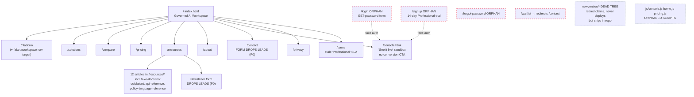

# GovernAI Marketing Website — UI/UX & Content Handoff Specification

**Version:** 1.0 · **Date:** 2026-07-24 · **Author:** Principal Product Architect & Enterprise UX Design Strategy
**Consumers:** Senior UI/UX Designer (Figma), Frontend Engineer (static site, Design System v5.0 "Command Authority")
**Inputs:** `/home/claude/audit/output/website_audit_notes.md` (current-state audit), `/home/claude/audit/output/{architecture,security,phases,Database,error_handling,prompts}.md` (verified product ground truth), site source `/home/claude/audit/GovernAI-website/`, product UI `/home/claude/audit/govern-ai/apps/frontend/src/components/`.

**Integrity rule (binding for every artifact in this spec):** only two metric types may appear on the redesigned site — (a) verifiable architecture facts traced to the audit docs, and (b) metrics tagged `[PLACEHOLDER — measure & validate before publishing]`. No invented numbers presented as real. Compliance *postures*, never certifications. Every quote attributed or labeled analysis. Fictional case studies replaced or labeled "illustrative scenario" at every touchpoint (card, title, article).

---

# 1. UX Audit & Heuristic Summary

## 1.1 Current usability & messaging flaws (from audit notes §0, §3, §5)

1. **Two lead-capture surfaces silently drop 100% of submissions.** The contact form (`contact.html`) and resources newsletter form (`resources.html`) fake client-side success with no backend. Every non-Calendly lead is lost. *This is a revenue-path outage, not a polish item.*
2. **Empty homepage logo strip.** `index.html` §03 references ten `logos/*.svg` files; no `logos/` directory exists in the repo. Images have `alt=""`, so failure is invisible — the "vendor-neutral" proof section renders as blank swatches.
3. **Dead JS shipped in the repo.** `js/console.js`, `js/home.js`, `js/pricing.js` are loaded by no page; `newversion/` is a full parallel site with *retired, non-compliant* claims ("SOC 2 Type II control principles") one accidental deploy away from regression.
4. **Fake "Workspace" nav item.** Nav link styled as a page but resolves to `platform.html#workspace`; on `/platform` both "Platform" and "Workspace" point at the same document with confused active states. The workspace — half the product story — has no page.
5. **No path into the real product.** Every funnel terminates at Calendly (personal handle `perplexed-vk` visible in the popup URL) or the sandbox. The real app (`apps/frontend`, NextAuth/MFA/SSO) is unreachable from the site.
6. **Orphan auth pages with a GET-method password form.** `login.html`/`signup.html`/`forgot-password.html` are linked from nowhere, fake-auth into `console.html`, and login's form is `action="console.html" method="GET"` — a credentials-over-GET anti-pattern (the inputs currently lack `name` attributes, so nothing is actually transmitted — the form is pure theater, one attribute away from putting a password in the URL). Signup promises "14 days, full Professional-tier features" — a tier that does not exist on `/pricing`.
7. **Invented metrics displace real ones.** Every number a visitor sees is fake ($5,040/$12,000, 31%, $15,080, 45%, 4,208 requests) while genuinely impressive verified numbers — 23 pipeline stages, FORCE RLS on 41/41 tables fail-closed, 7 compliance packs, 13 supervised loops, 5-minute HITL TTL, never-unlimited spend ceilings — appear nowhere.
8. **No security or architecture page; zero trust artifacts.** No /security, no /trust, no subprocessor list (despite the trust strip *claiming* one — audit claim #42), no status page, no team identity on About. The entire trust load is copy assertion.
9. **Console demo has no conversion CTA.** `console.html`'s sidebar offers only "← Back to site"; the moment of highest intent has no "Book a demo".
10. **Forward-looking capability claims lacked a governance artifact — now resolved by policy, not rewrite.** Founder ruling (2026-07): the website is intentionally future-proof. The claims previously flagged as overclaims — Slack/Notion/Jira/custom-REST connectors (#23), CloudWatch SIEM sink (#28), "your own database / your own servers" (#24/#37), strict "cross-party review, every time" (#6), blanket "if the log can't be written, the action doesn't run" (#4) — are **roadmap-backed commitments**: if a client needs one, development is fast-tracked. They **stay on the site as written** and are logged in the **Website Commitment Register** (`govern-ai/docs/GovernAI_Feature_Roadmap_2026-07-14.md`); see §1.4. The EU residency claim (#13) is **not in this set at all** — it is accurate at the deployment level (dedicated EU instance on AWS Europe; see §1.4) and is no longer treated as a flaw. The only remaining *genuine* precision items from the audit's claims list are those that are neither roadmap-backed nor deployment-backed: the Acme composite case study labeled as a named customer at card/title level, the promised-but-missing subprocessor list (#42), and the stale Professional-tier/SLA remnants (#43/#44).
11. **Root-vs-newversion drift** and vestigial build scripts (`build.js` etc.) create ongoing editorial risk; `.env.local` carries a committed Vercel OIDC token (hygiene flag).
12. **"Live" badge on a static CSS chart** (platform §03) undercuts the site's otherwise-disciplined "Simulated preview" labeling.
13. **Accessibility gaps on interactive widgets:** console tabs are `<div data-tab>` without `role="tab"`/keyboard support; filter pills lack `aria-pressed`; hero chat typing has no `aria-live`; `.stat-counter` misused for non-numeric persona words on `/solutions`.

## 1.2 Target personas & pain points

| Persona | Pain today | Primary UX goal on the site | Pages/sections that must serve them |
|---|---|---|---|
| **CTO / VP Engineering** — *architectural trust* | Can't tell whether GovernAI is a real system or a pitch deck; no architecture disclosure; fake numbers pattern-match to vaporware | Verify in <5 min that the platform is a real, coherently engineered system (pipeline, failover, isolation, ops) | **/architecture (NEW)**, /platform §pipeline, /compare (build-vs-buy), /security §infrastructure, resources → real docs path |
| **CISO / Head of Compliance** — *guardrails & evidence* | No security page, no subprocessor list, claims without artifacts; needs postures, controls, and evidence-on-demand, and will punish overclaim harder than absence | Find a Trust Center that answers the security questionnaire before it's sent; verify fail-closed behavior, RLS, CMK, audit immutability, compliance packs | **/security (NEW, Trust Center)**, /platform §governance/§compliance, HITL + kill-switch proof, /console Approvals & Audit tabs, privacy/DPA |
| **Lead AI Engineer / Head of AI** — *developer & team velocity* | Wants to know what daily use feels like: models, latency behavior, failover, connectors, prompt library, workspace outputs; allergic to marketing fluff | See the actual product surfaces (cockpit, routing, workspace) and understand the request lifecycle; try the sandbox without a sales gate | **/workspace (NEW, TaskTurbo)**, /console demo, /platform §chat/§models, /architecture §request lifecycle, /pricing (Free tier clarity) |

Design implication: the three personas map to the three NEW/rebuilt pages (/architecture, /security, /workspace) plus a repaired conversion funnel. Each persona must reach "their" page in ≤2 clicks from the homepage.

## 1.3 Prioritized severity table

| Pri | Flaw | Location | Fix owner | Fix summary |
|---|---|---|---|---|
| **P0** | Contact + newsletter forms silently drop leads | `contact.html`, `resources.html` | Eng | Wire to a real backend (form service or serverless endpoint) with server-side validation, success/error states, spam protection. **Blocks launch.** |
| **P0** | Broken `/logos` asset dependency (empty strip) | `index.html`, repo | Eng + Design | Restore SVGs into repo `/logos/` or replace with text-on-swatch chips (spec §5). |
| **P0** | Orphan auth pages; login form submits via GET (credentials-in-URL anti-pattern) | `login.html`, `signup.html`, `forgot-password.html` | Eng | Delete + 301 to `/contact` (or noindex) until real-app handoff exists. Kill "Professional tier / 14-day trial" copy. |
| **P0** | `newversion/` + orphan JS + stale claims deployable by accident; committed OIDC token | repo root | Eng | Purge `newversion/`, orphan JS, build scripts (and the stale `old code/` `.vercelignore` entry — that directory is already gone from the repo); rotate + remove `.env.local` token. |
| **P1** | No /security Trust Center (and #42 promises a subprocessor list that doesn't exist) | site-wide | Design + Content | Build /security per §3.3. Highest-credibility page the site can add — material is verified. |
| **P1** | No /architecture page | site-wide | Design + Content | Build per §3.4 (23-stage lifecycle, failover, RLS, loops). |
| **P1** | Fake nav "Workspace"; no TaskTurbo page | nav, `platform.html` | Design | Promote to real `/workspace` page per §3.11; fix active states. |
| **P1** | Invented metrics everywhere; real facts unused | index, platform, console, resources | Content | Replace per §4.2 proof-card system (real facts + tagged placeholders). |
| **P1** | Console demo lacks conversion CTA; "See it live" label overpromises | `console.html`, nav | Design | Persistent demo-shell CTA bar; relabel CTA "Explore the demo ↗" per §3.8. |
| **P1** | Genuine precision copy set: #43/#44 stale Professional tier + unverifiable SLA (terms/signup) | `terms.html`, `signup.html`, `pricing.html` FAQ | Content | Fix per §3 copy briefs. (#4, #6, #24, #28, #37 are no longer in this set — they are roadmap-backed commitments logged in the register, per §1.4; keep claims as written.) |
| **P2** | Roadmap-backed claims lack a commitment register | `platform.html`, `index.html`, `pricing.html`, `js/widgets.js` | Content | Log each forward-looking claim in the Website Commitment Register — roadmap (`govern-ai/docs/GovernAI_Feature_Roadmap_2026-07-14.md`) — **(done)**; claims stay on the site as written. Optional (non-mandatory): subtle "Fast-track available" / "On request" badge treatment per §1.4. |
| **P2** | Calendly personal handle `perplexed-vk` in booking modal | `js/shared.js` | Ops | Branded Calendly org URL. |
| **P2** | Acme card/title presents composite as named customer until clickthrough | `resources.html` | Content | Retitle "Illustrative scenario: cutting AI costs in mid-market logistics"; badge cards `Illustrative`. |
| **P2** | platform.html text-wall (11 same-rhythm sections) | `platform.html` | Design | Restructure per §3.2 (summary band + 3-pillar hierarchy). |
| **P2** | "Live" badge on static chart | `platform.html` §03 | Eng | Badge → "Simulated". Global rule: only real screenshots may omit the simulated label — and screenshots get "Product UI — vX" instead. |
| **P2** | A11y: div-tabs, aria-pressed, aria-live, stat-counter misuse | console, widgets | Eng | Fix per component-state table §5. |
| **P2** | SEO/meta: no sitemap.xml, robots.txt, canonicals, og:image | site-wide | Eng | Add during rebuild. |
| **P2** | Compare-page competitor facts lack visible "as of" date | `compare.html` | Content | Add "Verified as of <month year>" line + quarterly re-verification cadence. |

## 1.4 Roadmap-Backed Claims Register

**Policy (founder ruling, 2026-07):** the website is intentionally future-proof. The claims below are **roadmap-backed commitments** — if a client needs one, development is fast-tracked. They stay on the site exactly as written; each is logged in the **Website Commitment Register** in `govern-ai/docs/GovernAI_Feature_Roadmap_2026-07-14.md`, which is the single source of truth for commitment status. No copy rewrites or removals are in scope for these items.

| Register item | Website claim | Current in-product state (honest, one line) |
|---|---|---|
| Slack / Notion / Jira / custom-REST connectors | Knowledge connectors incl. "Slack, Notion, Jira… custom REST APIs" (platform §04, index §03, widgets) | Connectors shipped today: GitHub, Google Drive, Confluence, Salesforce, SharePoint, S3, SQL (`connectors.py`). |
| CloudWatch SIEM sink | "SIEM export to Splunk, Datadog, Elastic, or AWS CloudWatch" (platform §06, pricing) | Tenant SIEM sinks today: Splunk HEC, Datadog, Elastic, and generic webhook/S3-style delivery via Redis Streams export with retry + DLQ. |
| BYO datastore ("your own database / your own servers") | "All indexed content is stored in your own database…" (platform §04); "stored on your own servers" (platform §01); privacy.html | Today: content lives in GovernAI's tenant-isolated datastore under database-enforced FORCE RLS; operator access only via audited break-glass. |
| Enforced four-eyes approval mode | "Cross-party review, every time" / "the requester can never approve" (index §04, platform §05) | Today: approvals route cross-party by default; ADMIN and COMPLIANCE_OFFICER may self-approve, and every decision is logged. |
| Strict audit mode | "If the log can't be written, the action doesn't run" (index §04) | Today: fail-closed audit-before-action is enforced for break-glass content reads and governance verdicts; chat audit writes are retried fail-loud post-response. |
| **Deployment commitment (verified, not roadmap):** EU data residency | "EU employee data stays on EU infrastructure" (platform §02) | **Verified by deployment architecture:** EU customers are served by a dedicated GovernAI instance on AWS Europe; US customers on AWS US (aligns with `govern-ai/docs/design/epic-17-multi-region.md`). In-product regional routing is model-name-based today; the claim is accurate at the deployment level. |

**Optional design treatment (suggestion, not a requirement):** the designer MAY add a subtle badge variant — e.g. "Fast-track available" or "On request" in `--ink-muted` mono, matching the existing `.badge` primitives — on ConnectorTierRow entries and other register-item surfaces. This is offered purely as a refinement; shipping the claims unbadged is fully compliant with the policy.

**Unchanged:** the metrics integrity rule stands — invented numbers remain `[PLACEHOLDER — measure & validate before publishing]`-tagged; this register applies to capability claims only, never to metrics.

---

# 2. Information Architecture (IA) & Sitemap Redesign

## 2.1 Current sitemap (as deployed — orphans and dead weight marked)



## 2.2 Proposed sitemap

```mermaid
graph TD
    A["/ Home<br/>REBUILT hero + proof band"] --> B["/platform<br/>RESTRUCTURED: governance core<br/>3 pillars, summary band"]
    A --> W["/workspace NEW<br/>TaskTurbo governed workspace<br/>(replaces fake nav anchor)"]
    A --> S["/security NEW — Trust Center<br/>controls, subprocessors,<br/>postures, disclosure"]
    A --> R["/architecture NEW<br/>23-stage lifecycle, failover,<br/>RLS, ops loops"]
    A --> C["/solutions<br/>EXPANDED: persona matrix,<br/>FINRA + PCI DSS packs"]
    A --> D["/compare<br/>+ build-vs-buy visual,<br/>'verified as of' date"]
    A --> E["/pricing<br/>beta-honest tier cards,<br/>connector tiering"]
    A --> F["/resources<br/>relabeled: guides vs<br/>illustrative scenarios"]
    A --> G["/about"]
    A --> H["/contact<br/>WIRED backend (P0) +<br/>demo scheduler"]
    A --> I["/demo (was /console.html)<br/>'Explore the demo ↗'<br/>+ persistent CTA bar"]
    I --> H
    S --> S1["/security#subprocessors<br/>delivers claim #42"]
    F --> F1["9 marketing articles remap 1:1"]
    F --> F2["fake-docs trio → /docs stub<br/>'Docs in private beta —<br/>request access' (honest gate)"]
    A --> J["/privacy"]
    A --> K["/terms<br/>stale tier/SLA copy fixed"]
    X["/login /signup /forgot-password<br/>REMOVED → 301 /contact"]:::removed
    Y["newversion/ + orphan JS<br/>+ build scripts PURGED"]:::removed
    Z["/waitlist → 301 /contact (kept)"]
    classDef removed stroke:#F0546A,stroke-width:2px,stroke-dasharray: 5 5
```



## 2.3 Route change log

| Route | Status | Notes |
|---|---|---|
| `/workspace` | **NEW** | TaskTurbo story promoted from `platform.html#workspace` anchor to full page. Nav item "Workspace" now real. |
| `/security` | **NEW** | Trust Center. Absorbs + expands index/platform trust strips; ships the subprocessor list the site already claims. |
| `/architecture` | **NEW** | CTO page. `resources/ai-platform-architecture.html` and `multi-model-architecture.html` get prominent cross-links from it (remain as articles). |
| `/demo` | **RENAMED** from `console.html` | Honest label; nav CTA becomes "Explore the demo ↗". Keep `console.html` → 301. |
| `/platform` | RESTRUCTURED | Becomes the governance-core deep dive (workspace content moves out). |
| `/solutions`, `/compare`, `/pricing`, `/resources`, `/about`, `/contact` | REVISED in place | Per §3. |
| `/login`, `/signup`, `/forgot-password` | **REMOVED** | 301 → `/contact` until a real app handoff exists; then `/login` returns pointing at the product's NextAuth. |
| `newversion/*`, `js/{console,home,pricing}.js`, root build scripts (+ stale `old code/` `.vercelignore` entry — directory no longer in repo) | **PURGED** | Keep `console.js` widget ideas in a design-reference gist if wanted; not in the deployable tree. |
| `resources/{quickstart-guide,api-reference,policy-language-reference}.html` | REMAPPED | Re-badged "Product documentation — private beta" with request-access CTA; removed from the "Docs" card grouping that mimics a docs portal. Other 9 articles keep URLs. |
| `/waitlist` | kept as 301 | Collapse triple-redirect to single 301. |
| SEO plumbing | **NEW** | `sitemap.xml`, `robots.txt`, canonical tags, `og:image` (asset exists in `brand-kit/`), Organization + Product structured data. |

---

# 3. Component & Layout Wireframe Specifications

Conventions: all pages keep global chrome (sticky nav, footer, `.section-divider` between majors, dark default + light parity). ASCII blocks show full-width sections top-to-bottom. Component names in **bold** are new/reusable — states defined in §5. Copy is grounded in verified claims (audit §3 numbering cited as `#n`).

## 3.1 Home — `/` (File: `index.html`)

**UX Objective:** In one screen, prove "real product, real governance" — replace assertion-only trust with a verified-facts proof band and real-surface preview; route each persona to their page in one click.

```
+=====================================================================+
| NAV: GovernAI· | Platform Workspace Solutions Compare Pricing       |
|      Resources About | [theme] [Explore the demo ↗] [Book a demo]   |
+=====================================================================+
| HERO (2-col)                                                        |
| +------------------------------+  +------------------------------+ |
| | Eyebrow: PRIVATE BETA        |  |  DashboardPreviewFrame:      | |
| | H1 (short, parallel):        |  |  Governance Cockpit mockup   | |
| |  "The AI your people choose. |  |  (posture gauge + attention  | |
| |   The governance your CISO   |  |  tiles, §4.1-A)              | |
| |   requires."                 |  |  caption: "Product UI —      | |
| | Lead (<=25 words)            |  |  simulated data"             | |
| | [Book a demo] [Explore demo↗]|  |                              | |
| +------------------------------+  +------------------------------+ |
+---------------------------------------------------------------------+
| PROOF BAND — VerifiedFactCard x4 (horizontal scroll on mobile)      |
| +-----------+ +-----------+ +-----------+ +-----------+             |
| | 23-stage  | | RLS on    | | 7 compli- | | Append-   |             |
| | governed  | | 41/41     | | ance packs| | only audit|             |
| | pipeline  | | tables,   | | incl. EU  | | UPDATE/   |             |
| | on every  | | fail-     | | AI Act,   | | DELETE    |             |
| | request   | | closed    | | FINRA,PCI | | revoked   |             |
| +-----------+ +-----------+ +-----------+ +-----------+             |
| microcopy: "Verified against the shipped system — see /architecture"|
+---------------------------------------------------------------------+
| SECTION 01 — One product, two halves (kept, tightened)              |
| [ The Workspace card → /workspace ] [ The Governance Core →         |
|   /platform ]  + third slim card [ Proof → /security ]              |
+---------------------------------------------------------------------+
| SECTION 02 — Workspace teaser (3 bento cards max, not 6)            |
| Doc editor | Data studio | Compliance Shield (fail-closed redaction)|
| CTA: "Tour the workspace →" (/workspace)                            |
+---------------------------------------------------------------------+
| SECTION 03 — Every model, one governed pipeline                     |
| LogoChipStrip (REPAIRED assets or TextChip fallback):               |
|  Providers: OpenAI · Anthropic · Google · Mistral · OpenRouter      |
|  Connectors (keep full roadmap-backed set per §1.4): Google        |
|   Workspace · Microsoft 365 · Slack · GitHub · Confluence ·         |
|   Notion · Salesforce (optional "On request" badge on roadmap       |
|   items — suggestion only)                                          |
| + PipelineStageTicker (compact, 23 nodes, §4.3-a)                   |
+---------------------------------------------------------------------+
| SECTION 04 — Governed by default (4 cards, precision copy)          |
| Policy+DLP | HITL approvals w/ 5-min expiry | Agent kill switch |   |
| Audit trail (append-only)                                           |
+---------------------------------------------------------------------+
| SECTION 05 — Trust strip → links into /security                     |
| Tenant isolation | Audited break-glass | Subprocessor list (now a   |
| real link) | Encryption & CMK                                       |
+---------------------------------------------------------------------+
| SECTION 06 — Compare teaser row: "Everyone else does part of it"    |
| mini ComparisonTable (1 row x 5 cols) → /compare                    |
+---------------------------------------------------------------------+
| FINAL CTA PANEL + FOOTER (Workspace link in ALL footers)            |
+=====================================================================+
```

**Required UI Components:** **VerifiedFactCard**, **DashboardPreviewFrame**, **PipelineStageTicker** (compact mode), **LogoChipStrip** (with **TextChip** fallback), hero chat widget (retained as secondary, or replaced by cockpit frame — designer's call; do not run both above the fold), **ComparisonTable** (teaser variant), existing `.bento-grid`, `.section-divider`, card-hover pattern.

**Copy & Microcopy Brief:**
- Headline options: (1) "The AI your people choose. The governance your CISO requires." (2) "One governed AI workspace. Provable by design." (3) "Every request governed. Every action provable."
- Body key points: one pipeline governs every model call (23 ordered stages — #1); tenant isolation enforced in the database, fail-closed (#2); workspace where drafts get finished (docs/sheets/decks — #35); redaction fail-closed before anything leaves (#36); no personal ChatGPT logins, no unaudited keys (villain framing per brand guide).
- Register-backed claims (keep as written, per §1.4): the audit claim "if the log can't be written, the action doesn't run" (#4) and HITL "cross-party review, every time" (#6) stay on the site — they are logged in the Website Commitment Register as "strict audit mode" and "enforced four-eyes approval mode" respectively (`govern-ai/docs/GovernAI_Feature_Roadmap_2026-07-14.md`). No softening or rewrites. Optional: register-item badge treatment per §1.4 (suggestion only).
- CTAs: primary "Book a demo" (tooltip: "30 minutes with an engineer — no deck"); secondary "Explore the demo ↗" (tooltip: "Simulated sandbox — no signup"). Proof band helper link: "How we verify claims → /security#claims".

## 3.2 Platform — `/platform` (File: `platform.html`)

**UX Objective:** Convert the 11-section text-wall into a ranked, scannable governance-core deep dive: summary band ("three things to remember"), then 3 pillars. Workspace content exits to `/workspace`.

```
+=====================================================================+
| H1: "The governance core, in depth."                                |
| Lead + SummaryBand: 3 numbered takeaways w/ anchor links            |
|  1 Every request runs the 23-stage pipeline                         |
|  2 Controls fail closed, never open                                 |
|  3 Everything is evidenced (append-only audit, 6-mo min retention)  |
| Sticky pill TOC (reduced to 3 pillars + 8 anchors)                  |
+---------------------------------------------------------------------+
| PILLAR A — GOVERN (policy, DLP, HITL, agents)                       |
| A1 feature-row: Policy engine + Shadow Mode widget (kept)           |
|    copy fix: DLP baseline vs "50+ types with ML detection           |
|    (Presidio) enabled" (#10); EU residency claim KEPT AS-IS —       |
|    verified by deployment architecture (dedicated EU instance on    |
|    AWS Europe; §1.4, epic-17-multi-region.md)                       |
| A2 feature-row: HITL — REPLACE 4-dot animation with                 |
|    DashboardPreviewFrame: Approval Queue mockup (§4.1-B)            |
| A3 feature-row: Agent governance — Agent Timeline mockup (§4.1-F) + |
|    Emergency Stop widget (kept)                                     |
+---------------------------------------------------------------------+
| PILLAR B — ROUTE & SAVE (models, routing, cost)                     |
| B1 Model catalog + complexity router + InteractiveCodeWindow        |
|    (real request/response shape, x-budget-remaining header)         |
| B2 Failover: FailoverToggleDiagram (§4.3-c adjacent) — circuit      |
|    breakers, mid-stream fallback (#19,#20)                          |
| B3 Cost visibility: Org Usage Dashboard mockup (§4.1-E), badge      |
|    "Simulated preview" (kills fake 'Live' badge);                   |
|    savings copy → mechanisms named, numbers [PLACEHOLDER]           |
+---------------------------------------------------------------------+
| PILLAR C — PROVE (audit, compliance, SIEM, identity)                |
| C1 Audit Log widget (kept) + "append-only: UPDATE/DELETE revoked"   |
| C2 Compliance packs: PackGrid of the REAL 7 (EU AI Act, FINRA,      |
|    GDPR, HIPAA, NIST AI RMF, OWASP Agentic, PCI DSS) +              |
|    Compliance Posture Explorer mockup (§4.1-C)                      |
| C3 EU AI Act suite (kept, verified #27)                             |
| C4 SIEM: "Splunk HEC, Datadog, Elastic, AWS CloudWatch, or any      |
|    webhook — retried with dead-letter queue" (CloudWatch KEPT —     |
|    roadmap-backed register item, §1.4; optional "On request" badge) |
| C5 Identity: SSO (any OIDC), SCIM, TOTP MFA w/ anti-replay (#34 —   |
|    new!), CMK widget (kept) + break-glass reconciliation copy (#32) |
+---------------------------------------------------------------------+
| CROSS-LINK BAND: /architecture (CTO) | /security (CISO) |           |
| /workspace (users)  → FINAL CTA                                     |
+=====================================================================+
```

**Required UI Components:** **SummaryBand**, **DashboardPreviewFrame** ×4, **PackGrid**, **InteractiveCodeWindow**, **FailoverToggleDiagram**, retained widgets (Shadow Mode, budget slider, Emergency Stop, Audit Log, CMK vault) with §5 a11y fixes.

**Copy & Microcopy Brief:**
- Headlines: (1) "The governance core, in depth." (2) "Twenty-three stages between a prompt and a provider." (3) "Govern. Route. Prove."
- Body key points: pipeline order is load-bearing (injection checks before policy, routing before residency — architecture.md §5.2); policy store unreachable → 503, never ungoverned (stage 8, fail-closed); budgets are never unlimited — platform ceiling applies unconditionally (#16); approvals expire in 5 minutes if unreviewed (#7); DLP redactions are reversible for authorized reviewers via AES-256-GCM-encrypted span maps (#11 — new differentiator); connector list stays as published incl. Slack/Notion/Jira/custom-REST — roadmap-backed register items (#23, §1.4); "your own database" claim stays as written — roadmap-backed BYO-datastore register item (#24, §1.4); optionally add the register cross-reference / "On request" badge per §1.4 (suggestion only).
- CTAs: "See the full lifecycle → /architecture"; "Read the Trust Center → /security"; pillar-level "Book a demo". Helper microcopy under every mockup: "Product UI — simulated data".

## 3.3 Security / Trust Center — `/security` **NEW** (File: `security.html`)

**UX Objective:** Answer the CISO's questionnaire before it's sent. Every claim on this page traces to a verified control; it also *delivers* the promised subprocessor list (#42) and reconciles CMK vs break-glass (#32).

```
+=====================================================================+
| H1: "Security at GovernAI" · Lead: postures not certifications      |
| PostureBadgeRow: HIPAA-aligned · GDPR-aligned · CCPA-aligned ·      |
|  NIST AI RMF-aligned · SOC 2 in progress (posture language locked)  |
+---------------------------------------------------------------------+
| CONTROL GRID — VerifiedFactCard x8 (2 rows x 4)                     |
| Tenant isolation: FORCE RLS, 41/41 tables, fail-closed              |
| Encryption: AES-256-GCM envelope; CMK BYOK (AWS/Azure/GCP KMS)      |
| Crypto-shred: key revocation renders data unreadable (note:         |
|  provider deletion windows apply, e.g. AWS 7-day)                   |
| Audit: append-only, UPDATE/DELETE revoked; 6-month min retention    |
| MFA: RFC-6238 TOTP, encrypted seeds, anti-replay, org enforcement   |
| Access: IP allowlisting (CIDR, fail-closed); SSO any OIDC; SCIM     |
| Egress safety: SSRF-guarded webhooks w/ DNS pinning                 |
| Fail-closed doctrine: policy store down => 503, never ungoverned    |
+---------------------------------------------------------------------+
| SECTION: "When things fail, we fail closed"                         |
| FailoverToggleDiagram (§4.3-c): fail-open vs fail-closed toggle     |
+---------------------------------------------------------------------+
| SECTION: Operator access & break-glass (reconciles CMK claim)       |
| copy: scope-bound, reason-required; content unreadable until the    |
| audit row commits; CMK-revoked data is unreadable even to us        |
| + Accordion: "How do CMK and break-glass coexist?"                  |
+---------------------------------------------------------------------+
| SECTION: Human oversight & agents                                   |
| HITL state machine diagram (§4.3-d) | agent identities, budgets,    |
| kill switch (fail-closed default) | Emergency Stop = tenant 503     |
+---------------------------------------------------------------------+
| SECTION: #subprocessors — SubprocessorTable                         |
| Model providers (per routing config): OpenAI, Anthropic, Google,    |
| Mistral, Cohere, NVIDIA NIM, OpenRouter · Infra rows [CONTENT       |
| OWNER TO CONFIRM hosting/email vendors before publish] · "Last      |
| updated" date + change-notification note                            |
+---------------------------------------------------------------------+
| SECTION: #claims — "How we verify what we say"                      |
| short statement of the claims-audit practice + disclosure contact   |
| (security@ mailto) + Accordion FAQ (pen-test posture: state         |
| honestly what exists; no invented attestations)                     |
+---------------------------------------------------------------------+
| CTA: "Get the security overview PDF" [PLACEHOLDER asset — compile   |
| from this page before publish] + Book a demo                        |
+=====================================================================+
```

**Required UI Components:** **PostureBadgeRow**, **VerifiedFactCard**, **SubprocessorTable**, **Accordion**, **FailoverToggleDiagram**, **StateMachineDiagram**, mailto CTA. Visual reference for control depth: `siem-settings-panel.tsx`, `session-settings-panel.tsx`, `step-up-reauth-modal.tsx`, `retention-settings-panel.tsx` in `/home/claude/audit/govern-ai/apps/frontend/src/components/`.

**Copy & Microcopy Brief:**
- Headlines: (1) "Security you can interrogate." (2) "Built to fail closed." (3) "Every control, on the record."
- Body key points: all facts above from security.md/Database.md (RLS security.md:112, Database.md:704-705; CMK security.md:57-59; MFA security.md:42; break-glass security.md:27/73; audit immutability Database.md:540-541). No SOC 2/ISO badges; "SOC 2 in progress" text only.
- CTAs: "Report a vulnerability" (tooltip: "security@ — we respond to coordinated disclosure"); "Request the DPA" (routes to contact form, tagged topic). Microcopy under crypto-shred card: "Cloud KMS deletion windows apply; revocation takes effect immediately for decryption."

## 3.4 Architecture — `/architecture` **NEW** (File: `architecture.html`)

**UX Objective:** Give the CTO a 5-minute systems read that could only have been written about a real system: request lifecycle, failure behavior, isolation model, ops.

```
+=====================================================================+
| H1: "How a governed request actually runs." · Lead                  |
+---------------------------------------------------------------------+
| HERO DIAGRAM: PipelineStageTicker FULL MODE (§4.3-a)                |
| 23 stage nodes, grouped: Admission(1-7) · Policy&Safety(8-13) ·     |
| Context(14-18) · Routing(19-23); hover = stage card w/ short-       |
| circuit behavior (403/413/503/hitl_checkpoint)                      |
+---------------------------------------------------------------------+
| SECTION: Two halves, one handshake                                  |
| HandshakeDiagram (§4.3-b): TaskTurbo -> synchronous JWT-signed      |
| per-request call -> OmniGard gateway -> provider. Fail-closed:      |
| gateway unreachable => request refused, nothing egresses            |
+---------------------------------------------------------------------+
| SECTION: When providers fail                                        |
| feature-row: circuit breakers, model-health fallback ladder,        |
| mid-stream failover resuming from buffered tail (<=4KB) — with      |
| InteractiveCodeWindow showing the SSE `recovering` + `model_used`   |
| event sequence (real event names, simulated payload)                |
+---------------------------------------------------------------------+
| SECTION: Isolation model                                            |
| diagram: request task binds tenant context -> SET LOCAL             |
| app.current_tenant on every query -> FORCE RLS on 41/41 tables ->   |
| unbound context raises RLS_NO_TENANT_CONTEXT (fail-closed)          |
+---------------------------------------------------------------------+
| SECTION: Self-healing operations                                    |
| VerifiedFactCard row: 13 supervised background loops w/ Redis       |
| heartbeats · deep /health gate (DB + Redis + 7 heartbeats or 503) · |
| OpenTelemetry tracing · Prometheus metrics incl. a dedicated        |
| "control failed closed" alarm counter                               |
+---------------------------------------------------------------------+
| SECTION: Read more — links: multi-model architecture article,       |
| AI platform architecture article, /security                         |
| FINAL CTA: "Walk the pipeline with an engineer — Book a demo"       |
+=====================================================================+
```

**Required UI Components:** **PipelineStageTicker** (full), **HandshakeDiagram**, **StateMachineDiagram** (breaker states), **InteractiveCodeWindow**, **VerifiedFactCard**, isolation diagram (static SVG). Sources: architecture.md:648-706 (stage table — use real stage names), error_handling.md §1.4 (handshake), §4.3 (metrics), security.md:112.

**Copy & Microcopy Brief:**
- Headlines: (1) "How a governed request actually runs." (2) "Twenty-three stages. Zero ungoverned paths." (3) "Architecture, on the record."
- Body key points: stage order is deliberate (injection-before-policy; routing-before-residency); HITL is a pipeline short-circuit, not a bolt-on (stage 11 `StopPipeline`); semantic cache is scope-aware (stage 12); governed mode is default-on — the workspace cannot reach providers directly unless explicitly unlocked (#49).
- CTA: "Book a demo" + secondary "Read the Trust Center". Hover microcopy per stage node: one line, e.g. stage 8: "Policy store unreachable with no last-known-good → 503. We never serve ungoverned."

## 3.5 Solutions — `/solutions` (File: `solutions.html`)

**UX Objective:** Turn the thinnest page into persona-routed proof: industry cards cite the *actual* pack that serves them; persona capability matrix replaces the `.stat-counter` word strip.

```
+=====================================================================+
| H1 (kept): "Built for teams that can't afford an ungoverned AI      |
| rollout."                                                           |
+---------------------------------------------------------------------+
| INDUSTRY BENTO x4 (upgraded with real pack chips)                   |
| Financial Services [FINRA pack][PCI DSS pack] — HITL on trades,     |
|   never-unlimited spend ceilings                                    |
| Healthcare [HIPAA pack] — PII detection, 6-mo min audit retention,  |
|   approval gates                                                    |
| Legal [GDPR pack] — citations, CMK crypto-shred, per-matter policy  |
| Engineering [OWASP Agentic pack] — GitHub connector, complexity     |
|   routing, SSO/SCIM, agent kill switch                              |
+---------------------------------------------------------------------+
| PERSONA CAPABILITY MATRIX (ComparisonTable variant, 5 rows)         |
| rows: IT/Platform · CISO/Compliance · FinOps · Head of AI ·         |
| End users | cols: what they get, which page proves it               |
+---------------------------------------------------------------------+
| MOCKUP STRIP: Compliance Posture Explorer (§4.1-C) — "one heatmap   |
| across all 7 packs" | Shadow AI Assessment teaser (§4.1-D):         |
| "Assess your shadow-AI exposure — request a portal link" (lead-gen  |
| CTA -> contact, topic-tagged)                                       |
+---------------------------------------------------------------------+
| FINAL CTA                                                           |
+=====================================================================+
```

**Required UI Components:** industry bento with **PackChip**, **ComparisonTable** (persona variant), **DashboardPreviewFrame** ×2. Remove `.stat-counter` misuse.

**Copy & Microcopy Brief:**
- Headlines (section-level): (1) "Your regulator has a pack here." (2) "Governance that speaks your industry's language." (3) "Four industries, seven packs, one pipeline."
- Body: FINRA + PCI DSS named for the first time (#5 undersold — free win); every industry card ends with "Prove it → /security" or "/demo".
- CTAs: "Book a demo"; Shadow-AI teaser CTA "Request an assessment link" (tooltip: "We send a portal link; your team answers, you get a risk report."). No fabricated industry stats.

## 3.6 Pricing — `/pricing` (File: `pricing.html`)

**UX Objective:** Make demo-gated pricing feel deliberate, not evasive; differentiate tier CTAs; surface the connector-tiering story (full published connector set — roadmap-backed items included per §1.4).

```
+=====================================================================+
| H1: "Start free. Grow into full governance."                        |
| BetaBanner: "Private beta — Team seat pricing is set with your      |
| account during onboarding." (moved INSIDE the flow, above cards)    |
+---------------------------------------------------------------------+
| TIER CARDS x3                                                       |
| FREE $0 [Explore the demo ↗]  | TEAM per-seat, 'Most Popular'       |
| ("free models cost us nothing |  [Book a demo] + inline note:       |
| so they cost you nothing")    |  "pricing at onboarding"            |
|                               | ENTERPRISE Custom [Talk to us]      |
+---------------------------------------------------------------------+
| CONNECTOR TIERING ROW (full published set, incl. roadmap-backed     |
| Slack/Notion/Jira/custom-REST per §1.4): which connectors ship at   |
| Team vs Enterprise [CONTENT OWNER TO CONFIRM split before publish]  |
| optional badge variant on roadmap items: "Fast-track available" /   |
| "On request" (§1.4 — suggestion, not a requirement)                 |
+---------------------------------------------------------------------+
| FEATURE MATRIX (17 rows, kept; SIEM row keeps CloudWatch and        |
| connectors row keeps the published set — register items per §1.4)   |
+---------------------------------------------------------------------+
| FAQ Accordion (kept 4 + add: "Why no public Team price?" honest     |
| answer; "What happens when a seat is deprovisioned?" — soften       |
| billing claim per #31 until verified)                               |
| FINAL CTA                                                           |
+=====================================================================+
```

**Required UI Components:** tier cards (existing), **BetaBanner**, **ConnectorTierRow**, **Accordion**, matrix with bold checkmarks (kept). Differentiated CTAs per card (fixes "three identical demo CTAs").

**Copy & Microcopy Brief:**
- Headlines: keep H1; alt: "Free to start. Governed from day one." / "Pricing that matches a private beta: honest."
- Body: Free tier honesty framing kept (#verified free-model mechanism); budget copy adds "platform spend ceilings are never unlimited" (#16).
- CTAs: Free → "Explore the demo ↗"; Team → "Book a demo" (tooltip: "We'll quote seat pricing on the call"); Enterprise → "Talk to us". Terms page fix rides along: remove "Professional tier" + unverifiable 99.9% SLA (#43) → "SLA terms are agreed per Enterprise contract."

## 3.7 Compare — `/compare` (File: `compare.html`)

**UX Objective:** Keep the strong category framing; add the missing build-vs-buy visual and a visible verification date so dated competitor facts can't rot silently.

```
+=====================================================================+
| H1 (kept, qualifier intact): "...the only Governed AI Workspace."   |
| SubLine: "Competitor facts verified as of March 2026 — re-checked   |
| quarterly." [CONTENT OWNER: refresh before publish]                 |
+---------------------------------------------------------------------+
| CATEGORY CARDS x4 + GovernAI featured card (kept)                   |
+---------------------------------------------------------------------+
| NEW: BUILD-VS-BUY VISUAL (BuildVsBuyDiagram)                        |
| left column: gateway (Portkey) + agent identity (Prefactor) +       |
| orchestration (LangChain) + custom UI + custom audit glue           |
| = N systems, N contracts, seams between every pair                  |
| right column: one governed pipeline + workspace                     |
| NO invented cost figures — count the SEAMS, not dollars;            |
| $ estimate cell = [PLACEHOLDER — build TCO model before publishing] |
+---------------------------------------------------------------------+
| CAPABILITY MATRIX 8x5 (kept, incl. honest footnotes)                |
+---------------------------------------------------------------------+
| FINAL CTA                                                           |
+=====================================================================+
```

**Required UI Components:** **BuildVsBuyDiagram**, **ComparisonTable** (kept), **AsOfBadge**.

**Copy & Microcopy Brief:**
- Headlines for the new section: (1) "Assembling this yourself means owning every seam." (2) "Five products, or one pipeline." (3) "The integration tax is the product."
- Body: each seam = an ungoverned handoff (no shared audit trail, no shared policy store, no shared kill switch). GovernAI: one policy store, one audit trail, one kill switch — verified singular systems.
- CTA: "See the difference live — Explore the demo ↗".

## 3.8 Demo — `/demo` (File: rename of `console.html`)

**UX Objective:** Capture the highest-intent moment. Keep the honest sandbox; add a persistent conversion rail and fix widget a11y.

```
+=====================================================================+
| TOPBAR: [Sandbox Preview] [Simulated environment — not a live       |
| customer account] [All systems operational]                         |
+------+--------------------------------------------------------------+
| SIDE | TAB CONTENT (7 tabs kept: Chat, Governance, Cost, Knowledge, |
| BAR  | Approvals, Audit Log, Admin)                                 |
| tabs | a11y: role=tablist/tab/tabpanel + arrow-key nav (P2 fix)     |
| as   |                                                              |
| real | Knowledge tab: Slack citation script STAYS (demonstrates a   |
| tabs | roadmap-backed connector, §1.4); optional "preview" label    |
|      | on the Slack citation — suggestion only, not required        |
+------+--------------------------------------------------------------+
| NEW: persistent DemoCtaBar (bottom, non-blocking, dismissible)      |
| "Seen enough? [Book a demo]  ·  [Download security overview]        |
|  ·  ← Back to site"                                                 |
| appears after 45s OR after visiting 3rd tab (whichever first)       |
+=====================================================================+
```

**Required UI Components:** **DemoCtaBar** (new), existing console shell + widgets with §5 a11y states. Site-wide CTA relabel: "See it live ↗" → **"Explore the demo ↗"** (fixes the live/sandbox bait-and-switch, heuristic #12).

**Copy & Microcopy Brief:**
- CtaBar headline options: (1) "This is the simulation. See the real thing." (2) "Ready for a live tenant?" (3) "Walk it with an engineer."
- Microcopy: "30 minutes, engineer-led, your questions first." Dismiss control labeled "Keep exploring" (never a bare ×).
- All simulated totals inside tabs (e.g. "$15,080 saved") get suffix chip "Simulated" or are replaced by mechanism labels without dollar totals.

## 3.9 Resources — `/resources` (File: `resources.html` + `resources/*.html`)

**UX Objective:** Stop imitating a docs portal; label illustrative content at the card level; make the newsletter form real.

```
+=====================================================================+
| H1 + filter chips: Guides | Checklists | Illustrative scenarios |   |
| Reports | Product docs (beta)                                       |
+---------------------------------------------------------------------+
| CARD GRID (12)                                                      |
| - Acme card RETITLED: "Illustrative scenario: cutting AI costs in   |
|   mid-market logistics" + [Illustrative] badge (P2)                 |
| - Healthcare case study: same badge; verify in-article disclaimer   |
| - "State of AI Security 2026": drop "annual"; relabel "Perspective" |
|   until a real survey exists                                        |
| - Docs trio (quickstart/API/policy-language): grouped under         |
|   "Product documentation — private beta" with lock icon + CTA       |
|   "Request docs access" (contact, topic-tagged)                     |
+---------------------------------------------------------------------+
| NEWSLETTER: real backend (P0) — email field + explicit consent      |
| line + success/error/duplicate states                               |
| FINAL CTA                                                           |
+=====================================================================+
```

**Required UI Components:** resource cards + **IllustrativeBadge**, **DocsLockCard**, **NewsletterForm** (real states per §5), filter chips with `aria-pressed`.

**Copy & Microcopy Brief:**
- Newsletter headline options: (1) "One email a month. Governance signal, no noise." (2) "Ship notes from the governed frontier." (3) "What we shipped, what changed, what it means."
- Success: "Subscribed — confirmation sent to {email}." Error: "That didn't go through — try again or email hello@…". Duplicate: "You're already on the list."
- Article template: keep "Updated <date>"; add byline or "GovernAI analysis" label per brand quote rule.

## 3.10 Contact + Conversion Funnel — `/contact` (File: `contact.html`)

**UX Objective:** One page, three intents (demo, security review, docs/assessment access), all landing in a real backend.

```
+=====================================================================+
| H1: "Talk to an engineer, not a sequence."                          |
| 2-col:                                                              |
| +---------------------------+  +--------------------------------+  |
| | INTENT PICKER (radio      |  | CalendlyEmbed (branded org URL |  |
| |  cards): Book a demo /    |  |  — replaces perplexed-vk P2)   |  |
| |  Security review / Docs & |  |  shown when intent=demo        |  |
| |  assessment access        |  |                                |  |
| | FORM: name, work email,   |  | else: response-time promise    |  |
| |  company, message, topic  |  |  card + what-happens-next      |  |
| |  (auto from intent)       |  |  3-step strip                  |  |
| | [Send] — REAL BACKEND P0  |  |                                |  |
| +---------------------------+  +--------------------------------+  |
| Trust footer: privacy link + "we reply within N business days       |
| [PLACEHOLDER — commit to an SLA you can keep]"                      |
| REMOVE unverifiable "Global Offices: SF · London · Singapore" (#47) |
| unless the content owner can substantiate it                        |
+=====================================================================+
```

**Required UI Components:** **IntentPicker**, **ContactForm** (full state set: default/focus/validating/submitting/success/error/spam-blocked), **CalendlyEmbed**, what-happens-next strip.
**Funnel spec:** all site CTAs resolve to exactly three destinations — `/contact` (Book a demo), `/demo` (Explore), newsletter (nurture). Every terminal page (demo, security PDF request, docs request) confirms with a next step. Analytics events on submit success/failure so dropped leads are detectable forever after.

**Copy & Microcopy Brief:**
- Headlines: (1) "Talk to an engineer, not a sequence." (2) "Bring your hardest question." (3) "Book the demo your CISO will want to sit in on."
- Error microcopy: "We couldn't send this — nothing was lost; copy your message and email hello@… or try again." (Never fake success — that is the exact failure being fixed.)

## 3.11 Workspace (TaskTurbo) — `/workspace` **NEW** (File: `workspace.html`)

**UX Objective:** Give the product's user-facing half its own page: "the place work gets finished," visibly governed. Replaces the fake nav anchor.

```
+=====================================================================+
| H1: "Where work gets finished — governed by default."               |
| HERO: DashboardPreviewFrame — TaskTurbo governed drafting w/        |
| redaction chips (§4.1-G): chat left, artifact panel right           |
+---------------------------------------------------------------------+
| SURFACE BENTO x6 (verified #35):                                    |
| Doc editor (.docx) | Data studio (.xlsx, formulas preserved) |      |
| Deck builder (.pptx) | Decision matrix | Template library w/        |
| approval flow | Prompt library                                      |
| note: ".pdf" listed for ingest; doc EXPORT formats stated only as   |
| verified (docx/xlsx/pptx) per #35                                   |
+---------------------------------------------------------------------+
| SECTION: Compliance Shield — fail-closed redaction                  |
| feature-row + inline demo: text w/ PII -> redaction chips ->        |
| "if governance is down, nothing leaves" (#36 — stronger than        |
| current copy; POST /v1/redact, no local fallback)                   |
+---------------------------------------------------------------------+
| SECTION: Attachments & grounding                                    |
| drag-in pdf/docx/xlsx/images; citations panel; "your own servers"   |
| storage claim KEPT — roadmap-backed BYO-datastore register item     |
| (#37, §1.4); optional register badge, suggestion only               |
+---------------------------------------------------------------------+
| SECTION: The handshake (compact HandshakeDiagram §4.3-b) —          |
| "every workspace request rides the 23-stage pipeline"               |
| CROSS-LINKS: /platform · /architecture | FINAL CTA                  |
+=====================================================================+
```

**Required UI Components:** **DashboardPreviewFrame** (workspace variant), surface bento, **RedactionChipDemo**, **HandshakeDiagram** (compact), citations mock. Visual reference: `chat-workspace.tsx`, `artifact-panel.tsx`, `citations-panel.tsx`, `prompt-library.tsx`, `conversation-sidebar.tsx`.

**Copy & Microcopy Brief:**
- Headlines: (1) "Where work gets finished — governed by default." (2) "Not another chat box. A finished draft." (3) "Idea to artifact, inside the guardrails."
- Body: templates route through pending-approval before org-wide share (phases.md:171-188); 20 MB ingest cap and format guards framed as safety, not limits; free-model tier genuinely free (#verified).
- CTAs: "Explore the demo ↗" primary here (users want to touch it), "Book a demo" secondary. Redaction chip tooltip: "Redacted before it leaves — reversible only for authorized reviewers."

---

# 4. Enterprise Visuals, Metrics & Dashboard Mockup Specs

## 4.1 Dashboard / UI preview mockups (Figma deliverables)

Global rules: build at 1440×900 frame, render into **DashboardPreviewFrame** (browser-chrome shell, v5.0 tokens, dark + light variants); every instance carries a corner chip **"Simulated preview"** (or "Product UI — simulated data" when traced from real components). Simulated telemetry reuses `js/widgets.js` patterns (self-guarding init, interval ticks, `prefers-reduced-motion` collapse).

**A. Governance Cockpit — posture gauge + attention tiles** *(homepage hero, /platform)*
- Visual reference: `cockpit/cockpit-bands.tsx`, `cockpit-tiles.tsx`, `posture-gauge.tsx`, `posture-spend-tiles.tsx`, `attention-tile.tsx`, `sparkline.tsx`, `stat-tile.tsx`.
- Key elements: radial posture gauge; spend tiles with sparklines; attention tiles (pending approvals, policy hits, connector sync); integrations band.
- Interactive mechanics: sparkline tick every 4s (small delta walk); attention-tile count pulses on change; hover lifts tile (–4px, accent border, per brand pattern).
- Data honesty: all values simulated; approval count ties to the HITL mock so numbers agree across the page.

**B. Approval Queue (HITL)** *(/platform pillar A, /demo Approvals tab)*
- Visual reference: `approval-queue.tsx`, `approval-card.tsx`, `notification-bell.tsx`.
- Key elements: queue of approval cards (requester, action summary, detected write-intent, TTL countdown chip "expires in 4:32"), approve/deny buttons (visually present, non-functional in marketing frame), decision log line.
- Interactive mechanics: one card's TTL counts down live; at 0 it flips to "Expired — request refused" (this *is* the 5-minute TTL fact #7 made visceral). Hover reveals audit-line preview.
- Data honesty: "Simulated preview"; requester/reviewer names are obvious personas ("A. Reviewer"), never realistic fake customers.

**C. Compliance Posture Explorer — heatmap** *(/platform pillar C, /solutions)*
- Visual reference: `compliance/radial-gauge.tsx`, `framework-heatmap.tsx`, `framework-grid.tsx`, `posture-sparkline.tsx`, `control-evidence.tsx`, `compliance-posture-panel.tsx`, `evidence-panel.tsx`.
- Key elements: 7 framework columns (EU AI Act, FINRA, GDPR, HIPAA, NIST AI RMF, OWASP Agentic, PCI DSS — the real pack list, #5) × control rows heatmap; radial per-framework gauges; evidence drill-down side panel showing a control → evidence rows.
- Interactive mechanics: hover cell → control tooltip; click column header → gauge highlight; evidence panel slides in (static content).
- Data honesty: posture percentages simulated; framework names real; label "Simulated preview — framework packs shown are the shipped set."

**D. Shadow AI Assessment portal** *(/solutions teaser, possible campaign page)*
- Visual reference: `shadow-ai/assess-portal-client.tsx`, `portal-link-generator.tsx`, `report-view.tsx`, `severity.ts`.
- Key elements: portal-link generator card; respondent flow snippet; resulting risk report with severity chips.
- Interactive mechanics: static two-frame sequence (send link → report) with a subtle auto-advancing crossfade; pause on hover.
- Data honesty: report contents simulated; severity taxonomy real.

**E. Org Usage / FinOps dashboard** *(/platform pillar B — replaces fake-"Live" CSS chart)*
- Visual reference: `org-usage-dashboard.tsx`, `usage-dashboard.tsx`, `cost-optimization-breakdown.tsx`, `finops-export-panel.tsx`.
- Key elements: spend-by-team chart, cost-optimization breakdown by mechanism (semantic cache / compaction / complexity routing / prompt caching — mechanisms real, #17), FinOps CSV export button.
- Interactive mechanics: hover bar → team tooltip; mechanism legend toggles series. No dollar totals presented as outcomes — axis unlabeled or marked "illustrative $".
- Data honesty: "Simulated preview. Savings mechanisms shown are shipped; your numbers will vary."

**F. Agent Activity Timeline + Emergency Stop** *(/platform pillar A, /security)*
- Visual reference: `agent-timeline-panel.tsx`, `agent-activity-panel.tsx`, `agents-panel.tsx`, `emergency-stop-panel.tsx`.
- Key elements: per-agent timeline (identity chip, budget bar, actions, one "killed" event), kill-switch control with confirm dance, org-wide banner state.
- Interactive mechanics: reuse existing Emergency Stop widget mechanics from `js/widgets.js` (confirm → banner → restore); timeline autoplays one kill event per loop.
- Data honesty: "Simulated preview"; kill-switch semantics annotated "fail-closed by default" (#8).

**G. TaskTurbo governed drafting with redaction chips** *(/workspace hero, homepage workspace teaser)*
- Visual reference: `chat-workspace.tsx`, `chat-interface.tsx`, `artifact-panel.tsx`, `citations-panel.tsx`, `prompt-library.tsx`.
- Key elements: chat pane (user prompt containing an email + account number), response with inline **redaction chips** (`⟨EMAIL_1⟩`, `⟨ACCT_1⟩`), artifact panel rendering a .docx draft, citations footer.
- Interactive mechanics: extend the existing hero-chat typing engine (`GovernAI.typeText`): as text streams, PII spans snap into chips with a 120ms scale-in; chip hover tooltip "Redacted before egress — reversible for authorized reviewers" (#11).
- Data honesty: "Simulated preview"; document content generic (vendor-contract scenario already established in the hero script).

**H. Policy Compiler** *(/platform pillar A secondary, /architecture optional)*
- Visual reference: `policy-compiler-panel.tsx`, `policies-tabs.tsx`, `content-policy-panel.tsx`, `shadow-log-panel.tsx`.
- Key elements: policy draft editor, compile/activate flow ("compiled drafts with FOR UPDATE activation", phases.md:321), shadow-mode toggle wired to the existing Shadow Mode widget.
- Interactive mechanics: toggling shadow-mode flips verdict chips Would-block ↔ Blocked (existing widget logic).
- Data honesty: "Simulated preview."

## 4.2 Enterprise Metrics & Proof Cards

**Real-fact VerifiedFactCards** (each with a "source: architecture disclosure" footnote linking `/architecture` or `/security`):

| Card headline | Supporting line | Ground truth |
|---|---|---|
| **23** governance stages on every request | Ordered, load-bearing, short-circuiting | architecture.md:658 (`_CHAT_PIPELINE`) |
| **41/41** tenant tables under FORCE row-level security | Fail-closed: no tenant context, no query | security.md:112, Database.md:704-705 |
| **7** compliance packs, versioned | EU AI Act · FINRA · GDPR · HIPAA · NIST AI RMF · OWASP Agentic · PCI DSS | security.md:225 |
| Append-only audit trail | UPDATE/DELETE revoked at the database role | Database.md:540-541 |
| **5-minute** approval expiry | Unreviewed requests are refused, not forgotten | security.md:234 (TTL 300s) |
| Reversible DLP | AES-256-GCM-encrypted span maps, tenant-keyed | security.md:145 |
| Spend ceilings, never unlimited | Platform-level daily ceiling applies unconditionally | security.md:200 |
| **13** supervised background loops | Heartbeats gate the health endpoint | architecture.md:105, error_handling.md §4.7 |
| Crypto-shred via CMK revocation | BYOK: AWS, Azure, GCP KMS | security.md:57-59 |
| Fail-closed Compliance Shield | Governance down → nothing egresses | security.md:153, phases.md:264 |

**[PLACEHOLDER] cards** — each renders with the tag visible in design files and MUST NOT ship until measured:

| Card | Tag | How to measure (real instrumentation exists) |
|---|---|---|
| Gateway latency overhead (p95) | `[PLACEHOLDER — measure & validate before publishing]` | `histogram_quantile(0.95, rate(http_request_duration_seconds_bucket[5m]))` on govern-ai (prometheus_fastapi_instrumentator; Grafana panel already exists per error_handling.md §4.6); subtract provider time using OTel `llm.stream` spans. |
| DLP scan latency | same | `govern_ai_dlp_scan_seconds` histogram (1ms–5s buckets), error_handling.md §4.3. |
| Semantic cache hit rate | same | `govern_ai_semantic_cache_hits_total{tenant_id}` vs request totals; TaskTurbo side `governai_response_cache_hits_total` / `_misses_total`. |
| SIEM delivery lag | same | `govern_ai_siem_delivery_lag_seconds` histogram + `govern_ai_siem_delivery_total{success|retry|dlq}`. |
| Uptime / availability | same | Deep `/v1/health` (200 only when DB+Redis+7 heartbeats alive) scraped by an external monitor over ≥90 days before any figure is published. No SLA claim until contracted (fixes #43). |
| Failover recovery rate | same | `govern_ai_model_fallbacks_total{primary_model,fallback_model}` joined with completion outcomes from OTel spans. |
| Cost-savings % | same | Requires cohort measurement via `cost-optimization-breakdown` data over real tenants; until then, name mechanisms without percentages (replaces 20–40% / 31% / 45% / $15,080 — #17). |

## 4.3 System Diagrams & Motion Assets

**(a) Governed request lifecycle — 23-stage pipeline ticker**
- Concept: the site's single signature visual. A horizontal step-node ticker of the real 23 stages, grouped into 4 phases (Admission 1–7, Policy & Safety 8–13, Context 14–18, Routing 19–23), a pulse traveling left→right; occasionally a pulse dies at a gate node with its real short-circuit code (403 / 413 / 429 / 503 / `hitl_checkpoint`).
- Visual pattern: mono-font stage labels from architecture.md:662-686 (`IPAllowlistStage` … `ReasoningEffortStage`), teal pulse on navy, danger-color short-circuit flash; compact mode (homepage: phase groups only) and full mode (/architecture: all 23 nodes with hover cards).
- Motion: CSS keyframes + IntersectionObserver start (reuse `.reveal` infra); `prefers-reduced-motion` → static diagram with numbered nodes.
- Source of truth: architecture.md §5.2(b) stage table.

**(b) TaskTurbo ↔ GovernAI gateway handshake**
- Concept: how the workspace half talks to the governance half. **Accuracy requirement: synchronous, per-request, JWT-authenticated calls (HS256 or RS256/ES256 with `kid`), fail-closed — NOT a queued job handoff.** Gateway unreachable ⇒ the request is refused; half-configured governance ⇒ loud error (error_handling.md §1.4).
- Visual pattern: two-lane sequence diagram: TaskTurbo → [mint JWT] → OmniGard `POST /v1/chat/completions` (pipeline chip) → provider → response streams back; a second lane shows `POST /v1/redact` for Compliance Shield with a red "no local fallback — fails closed" gate.
- Motion: single request dot traversing the lanes on scroll-into-view; failure variant on toggle.
- Source of truth: error_handling.md §1.4, security.md:153, architecture.md:54.

**(c) Fail-closed vs fail-open — before/after toggle**
- Concept: interactive toggle showing the same outage (policy store down / Redis down / redaction service down) under two philosophies. Fail-open: request sails through ungoverned (danger trail). Fail-closed (GovernAI): request stops at the gate with the real behavior — 503 `policy_unavailable`, `RLS_NO_TENANT_CONTEXT`, redaction refusal.
- Visual pattern: reuse the Shadow Mode toggle mechanics (`js/widgets.js`) — a `role="switch"` flips row outcomes; rows list real controls with their real fail modes (budget, agent-kill `AGENT_KILL_FAIL_CLOSED`, IP allowlist, policy load, Compliance Shield).
- Source of truth: security.md:200/204/221, error_handling.md pipeline stage 8, `govern_ai_control_failed_closed_total` metric (the product literally alarms on silent control loss — quote this in the caption).

**(d) HITL approval state machine**
- Concept: the lifecycle of a gated action: `Requested → Write-intent detected → Pending (TTL 300s) → Approved → Executed` / `→ Denied` / `→ Expired (refused)`.
- Visual pattern: horizontal state diagram with the TTL as a draining ring on the Pending node. The site's "cross-party review, every time" claim stays as written (roadmap-backed "enforced four-eyes approval mode" register item, §1.4 — not a claim fix); optional footnote suggestion (non-mandatory): "Enforced four-eyes mode — fast-track available on request; every decision is logged."
- Motion: auto-advance one happy path, then one expiry path; Replay control (pattern exists in the current approval-flow widget).
- Source of truth: security.md:234; pipeline stage 11 (`StopPipeline` short-circuit).

---

# 5. UI Component State & Design System Additions

## 5.1 New reusable components

| Component | States required | Data source / grounding |
|---|---|---|
| **VerifiedFactCard** | Default · Hover (lift + accent border) · Footnote-expanded | Static — each instance hard-bound to an audit-doc citation (§4.2 table). No dynamic data. |
| **DashboardPreviewFrame** | Default · Hover (parallax ≤4px) · Reduced-motion static · Light/Dark | Static mockup images/HTML traced from real components (§4.1 refs); simulated ticks via widgets.js patterns. Always carries "Simulated preview" chip. |
| **PipelineStageTicker** | Idle · Animating · Short-circuit flash · Hover (stage card) · Reduced-motion static · Compact/Full | Static stage list from architecture.md §5.2(b) — real names, real short-circuit codes. |
| **HandshakeDiagram** | Idle · Animating · Failure-variant toggle · Reduced-motion | Static; semantics from error_handling.md §1.4 (synchronous JWT, fail-closed). |
| **FailoverToggleDiagram** | Fail-open · Fail-closed · Transitioning · Reduced-motion | Static rows of real controls + fail modes (security.md); toggle reuses `role="switch"` + `aria-checked`. |
| **StateMachineDiagram** (HITL / breaker) | Auto-playing · Paused · Replay · Reduced-motion | Static; security.md:234, error_handling.md breaker states. |
| **DemoCtaBar** | Hidden · Revealed (45s or 3rd tab) · Hover · Dismissed (session-persisted) | Static/simulated; sessionStorage like theme toggle. |
| **ContactForm / NewsletterForm** | Default · Focus · Inline-invalid · Submitting (spinner ≥400ms) · Success · **Error (message preserved — never fake success)** · Duplicate (newsletter) · Spam-blocked | **Real backend (P0)** — form service or serverless endpoint; analytics on all terminal states. |
| **IntentPicker** | Default · Hover · Selected · Keyboard-focused | Static; drives ContactForm topic + Calendly reveal. |
| **LogoChipStrip / TextChip** | Default · Hover (chip lift −3px) · **Image-error fallback → TextChip** (fixes silent alt="" failure) | Static assets in restored `/logos/`; `onerror` swaps to text chip. |
| **PackChip / PackGrid** | Default · Hover (pack summary tooltip) | Static — the real 7 pack IDs (security.md:225). |
| **SubprocessorTable** | Default · Row-hover · "Last updated" freshness badge (stale >90d = warning tint) | Static content, editorially owned; model-provider rows from architecture.md:249. |
| **AsOfBadge** | Current · Stale (>1 quarter, warning tint) | Static date, updated on the compare-page verification cadence. |
| **IllustrativeBadge** | Default (warning-soft tint, mono label) | Static; applied to composite case-study cards + titles. |
| **BuildVsBuyDiagram** | Default · Hover (seam highlight) · Reduced-motion | Static; seams counted, dollars `[PLACEHOLDER]`. |
| **RedactionChipDemo** | Streaming · Chip snap-in · Chip hover tooltip · Reduced-motion (pre-redacted) | Simulated via extended `GovernAI.typeText`; semantics from security.md:145. |
| **SummaryBand** | Default · Anchor-hover | Static. |
| **BetaBanner / DocsLockCard** | Default · Hover · (DocsLock) CTA-focus | Static. |
| **ComparisonTable** (teaser / persona / capability variants) | Default · Row-hover · Sticky header (full variant) | Static; capability-matrix content kept from `compare.html` (8×5); teaser variant §3.1, persona variant §3.5. |
| **InteractiveCodeWindow** | Default · Hover (copy-button reveal) · Copied confirmation · Reduced-motion | Static; real request/response shape incl. `x-budget-remaining` header (§3.2 B1) and SSE `recovering`/`model_used` sequence (§3.4) — real event names, simulated payloads. |
| **PostureBadgeRow** | Default · Hover (posture-definition tooltip) | Static; posture language locked (HIPAA/GDPR/CCPA/NIST AI RMF-aligned, SOC 2 in progress) — matches the existing trust-strip copy; never certification badges. |
| **Accordion** | Collapsed · Expanded · Keyboard-focused | Static; native `<details>` or `aria-expanded` buttons; /security FAQ (§3.3) + /pricing FAQ (§3.6). |
| **ConnectorTierRow** | Default · Hover (connector tooltip) · *Optional* badge variant ("Fast-track available" / "On request" — §1.4, suggestion only) | Static; full published connector set — shipped 7 (`connectors.py`: GitHub, Google Drive, Confluence, Salesforce, SharePoint, S3, SQL) + roadmap-backed register items (Slack, Notion, Jira, custom REST — §1.4); Team/Enterprise split `[CONTENT OWNER TO CONFIRM]` (§3.6). |
| **CalendlyEmbed** | Loading · Loaded · Load-failed (fallback link to booking URL) | Existing `js/shared.js` Calendly popup pattern, rehosted inline; branded org URL replaces `perplexed-vk` (P2); revealed by IntentPicker (§3.10). |
| **Retrofit set** (existing widgets) | Console tabs → `role="tablist/tab/tabpanel"` + arrow keys; filter pills → `aria-pressed`; hero chat → `aria-live="polite"` region; audit table Empty state ("No events match — clear filters"); budget slider Error state at 100% retains "AI access paused" copy | Existing `js/widgets.js` / `js/shared.js`; a11y fixes are P2 items from audit §5.22. |

## 5.2 Design-token additions (v5.0 "Command Authority" — keep navy/teal identity)

Only additive; no re-theming:

- `--verified: var(--success)` semantic alias + `--verified-soft` tint — VerifiedFactCard accent rail. Light-mode pair uses existing `#0A7A4C`.
- `--placeholder-flag: var(--warning)` — the visual treatment for `[PLACEHOLDER]` cards in design files (warning-soft fill + dashed border `1px dashed rgba(245,184,78,.5)`), so unmeasured metrics are impossible to ship unnoticed.
- `--chip-redaction` = `--accent-2` soft fill + mono label (accent-2 already reserved "gradients/data viz only" — chips qualify as data viz; confirm with brand owner).
- Breakpoint tokens: promote the ad-hoc 1024/900/768/640/600/560 set to named tokens `--bp-lg/md/sm/xs` (audit §2.1 flagged the ad-hoc scale); no visual change, refactor only.
- Motion: one new token `--tick-interval: 4s` for simulated-telemetry cadence consistency.
- **Light-mode parity + WCAG AA:** every new component ships both themes; reuse the documented contrast-corrected accents (`#0A6E78` text-teal on light). Verify VerifiedFactCard footnote text ≥4.5:1 in both themes; PipelineStageTicker stage labels use `--ink-secondary` minimum, never `--ink-muted` under 14px. All new interactive elements: visible focus ring (existing accent ring token), keyboard operability, `prefers-reduced-motion` static fallbacks as specified per component.

## 5.3 P0 build order

1. **Wire contact + newsletter forms to a real backend** (success/error states per §5.1; analytics on terminal states). Nothing else matters if leads keep vanishing.
2. **Purge the hazard tree:** delete `newversion/`, orphan JS (`console.js`, `home.js`, `pricing.js`), vestigial build scripts, and the stale `old code/` `.vercelignore` entry (the directory itself is already gone); rotate + remove the committed `.env.local` OIDC token; 301 `login/signup/forgot-password` → `/contact`.
3. **Genuine-fix sweep on existing pages** (no redesign needed): terms.html Professional-tier/SLA fix (#43), signup.html stale-trial copy (#44), Acme card retitle + `Illustrative` badges, subprocessor list delivery (/security#subprocessors, #42), and add Website Commitment Register cross-references where roadmap-backed claims appear (§1.4). **No claim removals:** connectors, CloudWatch, "your own database/servers", "every time" HITL, blanket audit claim, and the EU residency line all stay as written (register-backed / deployment-verified per §1.4).
4. **Restore `/logos/` assets** (or ship TextChip fallback) — un-break the homepage proof strip.
5. **Homepage proof band** (VerifiedFactCard ×4) + CTA relabel "Explore the demo ↗" + DemoCtaBar in the demo shell — the cheapest high-leverage conversion fixes.
6. **/security Trust Center** (§3.3) incl. subprocessor table — closes the site's largest credibility gap with already-verified material.
7. **/architecture + PipelineStageTicker** (§3.4, §4.3-a) — the signature visual; compact variant feeds the homepage.
8. **/workspace page + nav fix** (§3.11), then the /platform restructure (§3.2) and remaining mockups (§4.1) as the designer's Figma queue.

*End of specification.*
